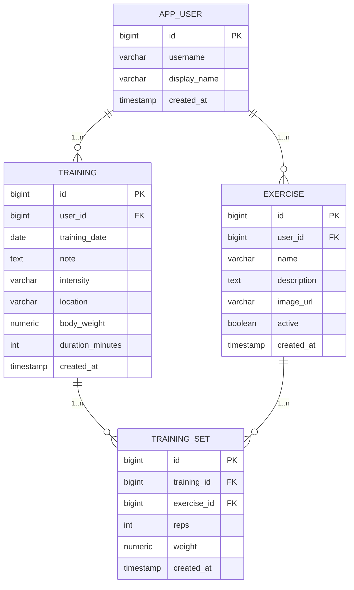
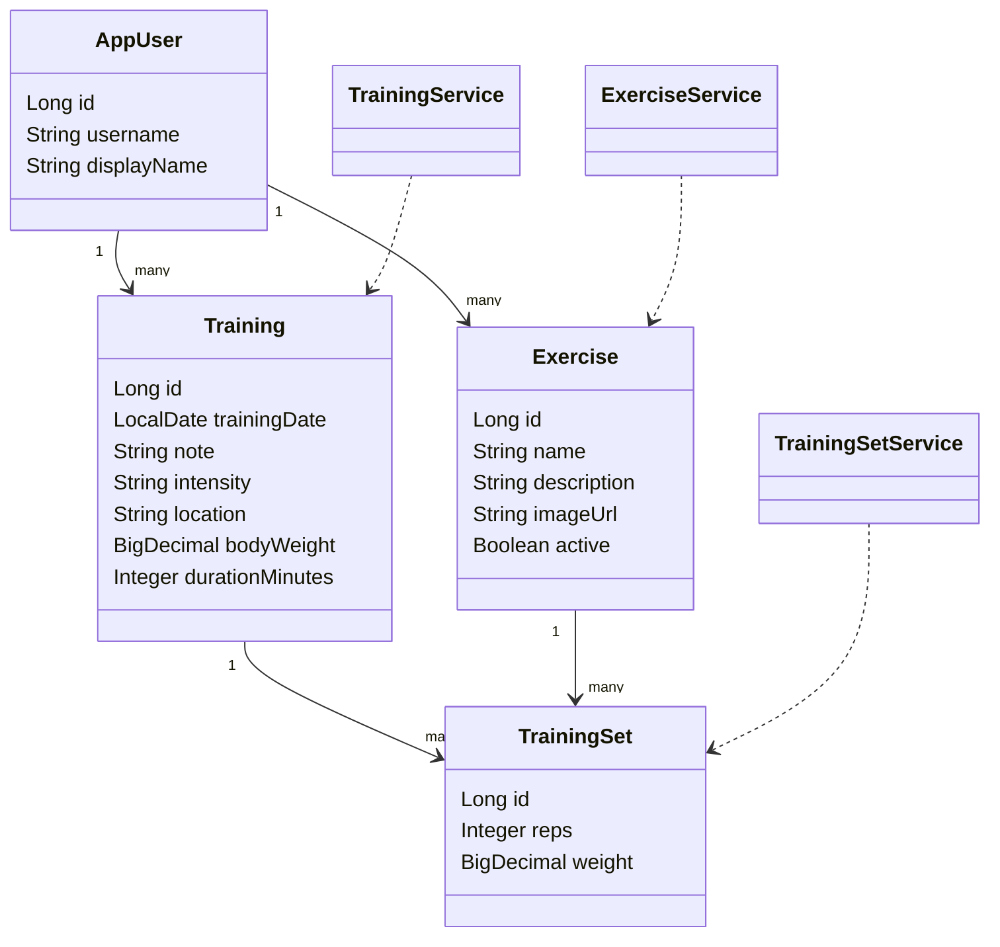

# GymTracker

GymTracker to aplikacja webowa MVC w Spring Boot + Thymeleaf. UI (formularze, redirect 302) jest glownym sposobem pracy,
a REST API `/api` jest dodatkiem wykorzystywanym opcjonalnie.

## Wariant projektu: Wariant II (MVC)
- Widoki: Thymeleaf + Bootstrap (`/`, `/manage`, `/history`, `/stats`).
- Kontrolery UI steruja przeplywem i deleguja logike do serwisow.
- Logika biznesowa jest w warstwie `service`, dostep do danych w `repository` (Spring Data JPA).
- Kontrolery REST sa oddzielone i maja prefiks `/api`, bez mieszania z UI.

## Specyfikacja
### Wymagania funkcjonalne
1) Uzytkownik moze dodawac, edytowac i usuwac cwiczenia.
2) Uzytkownik moze tworzyc treningi (data + notatka) i przegladac liste treningow.
3) Uzytkownik moze dodawac i usuwac serie w ramach treningu.
4) Uzytkownik moze przegladac historie serii dla wybranego cwiczenia.

### Wymagania pozafunkcjonalne
1) Walidacja danych wejsciowych z czytelnymi komunikatami bledow w UI.
2) Spojny format bledow w JSON i poprawne kody HTTP w API.
3) Projekt zawiera testy automatyczne uruchamiane komenda `./mvnw test`.

### Krotki opis projektu
GymTracker to aplikacja webowa, ktora pozwala planowac treningi i prowadzic dziennik serii,
zapewniajac szybki podglad historii oraz statystyk progresu.

### Potencjalni odbiorcy
- Osoby trenujace silowo i amatorsko, ktore chca sledzic progres.
- Trenerzy personalni prowadzacy podstawowy dziennik treningow podopiecznych.

### Korzysci biznesowe
- Zwiekszenie retencji uzytkownikow dzieki historii treningow i statystykom.
- Umozliwienie analizy progresu, co wspiera sprzedaz planow i uslug treningowych.

## Wymagania
- Java 21
- Maven
- PostgreSQL (lokalnie)

## Uruchomienie lokalne
1) Utworz baze danych:
```sql
create database gymtracker;
```
2) Upewnij sie, ze dane dostepu w `src/main/resources/application.properties` sa poprawne.
3) Uruchom aplikacje:
```bash
./mvnw spring-boot:run
```
Po uruchomieniu aplikacji migracje Flyway utworza tabele w bazie automatycznie.
4) Otworz UI: `http://localhost:8080`

## Uwierzytelnianie
Logowanie nie jest wymagane. UI i REST API sa dostepne bez autoryzacji.
W bazie danych istnieje uzytkownik techniczny (demo), do ktorego przypisywane sa dane.
Spring Security jest uzyte w projekcie, ale konfiguracja dopuszcza dostep publiczny (permitAll) do UI i API.

## Widoki UI (glowny interfejs)
- `/` - dashboard (dodawanie, lista treningow i serii)
- `/history` - historia serii dla wybranego cwiczenia
- `/stats` - podsumowanie i statystyki cwiczen
- `/manage` - edycja i usuwanie cwiczen oraz treningow

## Dodawanie wielu cwiczen z UI
- Kliknij przycisk `Dodaj kilka cwiczen` na pulpicie, aby otworzyc modal z lista wierszy.
- Kazdy wiersz to jedno cwiczenie: nazwa jest wymagana, reszta pol jest opcjonalna.
- Dodawaj lub usuwaj wiersze przyciskami w modalu; puste wiersze sa automatycznie pomijane przy zapisie.
- Status aktywnosci ustawiasz per wiersz, bez wklejania danych zrodel oddzielonych srednikami.

## Architektura MVC i separacja warstw
- `pl.wsb.students.gymtracker.web` - kontrolery UI (Thymeleaf, formularze, redirect).
- `pl.wsb.students.gymtracker.service` - logika biznesowa i przypadki uzycia.
- `pl.wsb.students.gymtracker.repository` - dostep do danych (Spring Data JPA).
- `pl.wsb.students.gymtracker.domain` - encje JPA.
- `pl.wsb.students.gymtracker.api` - REST API (dodatkowe).

## REST API (dodatkowe)
REST API jest dodatkiem do aplikacji MVC i nie jest glownym sposobem pracy z systemem.

### Glowne endpointy REST
- `GET /api/exercises` - lista cwiczen
- `POST /api/exercises` - tworzenie cwiczenia
- `GET /api/exercises/{id}` - szczegoly cwiczenia
- `PUT /api/exercises/{id}` - aktualizacja cwiczenia
- `DELETE /api/exercises/{id}` - usuniecie cwiczenia
- `POST /api/trainings` - utworzenie treningu
- `GET /api/trainings` - lista treningow
- `GET /api/trainings/{id}` - szczegoly treningu z seriami
- `PUT /api/trainings/{id}` - aktualizacja treningu (data, notatka)
- `POST /api/trainings/{id}/sets` - dodanie serii do treningu
- `DELETE /api/trainings/{trainingId}/sets/{setId}` - usuniecie serii
- `GET /api/exercises/{id}/history` - historia serii dla cwiczenia
- `GET /api/stats/summary` - podsumowanie statystyk
- `GET /api/stats/exercises` - statystyki per cwiczenie

### Swagger / OpenAPI
- UI: `http://localhost:8080/swagger-ui/index.html`
- Specyfikacja JSON: `http://localhost:8080/v3/api-docs`

### Przykladowe requesty
```bash
curl -H "Content-Type: application/json" \
  -d '{"name":"Przysiad","description":"Stabilizacja core"}' \
  http://localhost:8080/api/exercises

curl -H "Content-Type: application/json" \
  -d '{"date":"2025-01-10","note":"Sila + mobilnosc"}' \
  http://localhost:8080/api/trainings
```

## Stos technologiczny
- Java 21 + Spring Boot 3.3.2
- Spring Web MVC + Spring Data JPA
- PostgreSQL + Flyway
- Thymeleaf + Bootstrap

## Diagram bazy danych (ER)

Indeksy: `idx_exercise_user`, `idx_training_user_date`, `idx_training_set_exercise`, `idx_training_set_training`.

### Struktura bazy danych (opis)
- APP_USER: PK(id)
- EXERCISE: PK(id), FK(user_id -> app_user.id), indeks idx_exercise_user(user_id)
- TRAINING: PK(id), FK(user_id -> app_user.id), indeks idx_training_user_date(user_id, training_date)
- TRAINING_SET: PK(id), FK(training_id -> training.id), FK(exercise_id -> exercise.id),
  indeksy idx_training_set_training(training_id), idx_training_set_exercise(exercise_id)

## Diagram klas (fragment)


## Testy
Projekt zawiera minimum 4 testy automatyczne:
- `src/test/java/pl/wsb/students/gymtracker/service/ExerciseServiceTest.java`
- `src/test/java/pl/wsb/students/gymtracker/service/TrainingServiceTest.java`
- `src/test/java/pl/wsb/students/gymtracker/service/TrainingSetServiceTest.java`
- `src/test/java/pl/wsb/students/gymtracker/service/StatsServiceTest.java`
- `src/test/java/pl/wsb/students/gymtracker/api/ApiIntegrationTests.java`

```bash
./mvnw test
```
